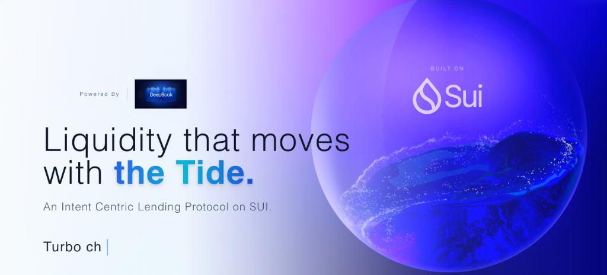
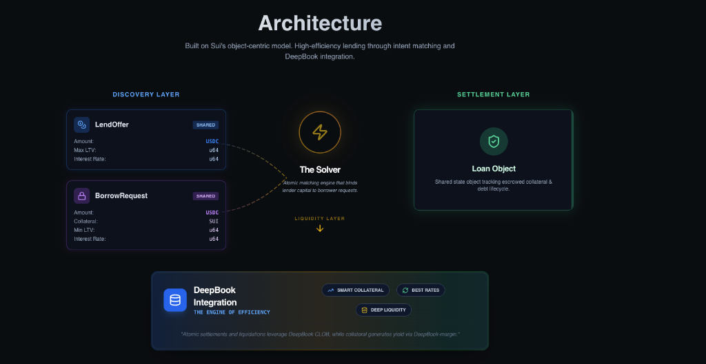

#  Tide Protocol

**An Intent Centric Lending Protocol on SUI.**

## Overview

Tide Protocol revolutionizes DeFi lending by moving away from traditional pool-based models to a peer-to-peer, intent-centric architecture. By matching lenders and borrowers directly through off chain solvers, Tide eliminates spread and prevents socialized bad debt.

**Liquidity that moves with the Tide.**

- **No Pools:** Direct matching between counterparties.
- **No Bad Debt Socialization:** Your risk is isolated to your specific loans.
- **Instant Execution:** Zero spread, highly efficient market matching.

## Architecture

Built on Sui's object-centric model, Tide leverages the speed and efficiency of the network to offer a seamless lending experience.

### Key Features

- **Intent-Based Matching**: Lenders create `LendOffers` and borrowers create `BorrowRequests`. Our solver matches these intents atomically.
- **DeepBook Integration**: Powered by DeepBook-V3 for atomic swaps, allowing borrowers to repay loans using their collateral directly and enabling efficient liquidations.
- **Smart Collateral**: Utilizes the composability of Sui objects to ensure collateral is securely escrowed and managed.

## 🔒 Security & Audit

> **Note:** The Move smart contracts powering Tide Protocol are currently being **audited and formally verified using the Certora Sui Prover**.

We are committed to the highest standards of security. Our formal verification process ensures that core invariants of the protocol hold true under all conditions.

## 📚 Documentation

Detailed code documentation and developer guides will be released soon. Stay tuned for updates on our technical implementation and integration guides.

## Tech Stack

- **Frontend**: React, Vite, TypeScript, Tailwind CSS
- **Blockchain**: Sui Network (Testnet)
- **Integration**: @mysten/dapp-kit, DeepBook V3

---

© 2026 Tide Protocol. Built on Sui.
